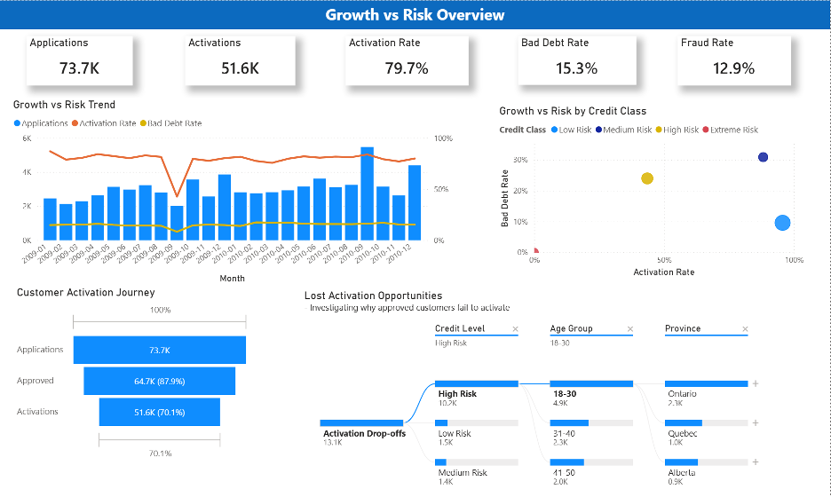
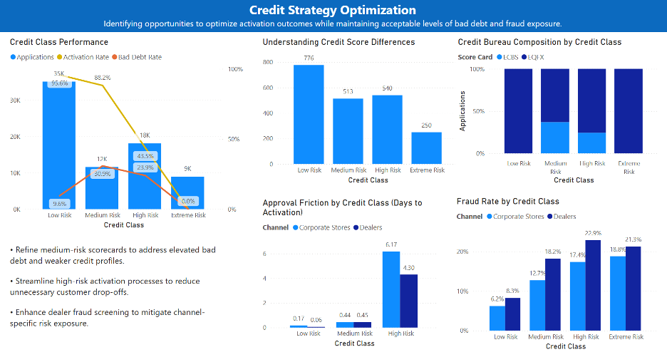
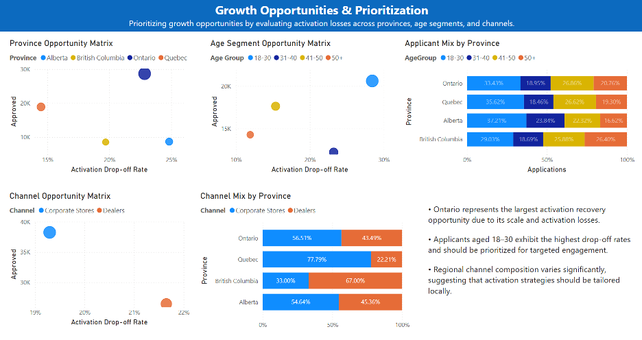

# Telecom Credit Risk Analytics Dashboard

## Business Problem

A telecom company aimed to increase customer activations while maintaining acceptable credit risk levels. The objective of this analysis was to identify activation bottlenecks, evaluate risk performance across customer segments, and uncover opportunities to improve both activation rates and portfolio quality.

## Dataset

The analysis was conducted using 24 months of historical application and activation data, covering 73.7K customer applications.

Key attributes included:

- Customer demographics
- Credit score
- Credit class
- Province
- Channel type
- Activation status
- Bad debt indicators

## KPIs

| KPI | Description |
|------|------|
| Applications | Total customer applications |
| Approved | Eligible applications |
| Activations | Activated customers |
| Activation Rate | Activations / Approved |
| Activation Drop-offs | Approved - Activations |
| Bad Debt Rate | 1-year bad debt write-off rate after activation |
| Fraud Rate | Fraud cases / Applications |

## Dashboard Preview

### Overview Dashboard

**Highlights**

- 73.7K applications analyzed
- 79.7% activation rate
- Activation drop-offs concentrated in Ontario and younger applicants

### Credit Strategy Optimization

**Highlights**

- Medium-risk segment showed higher bad debt rates than expected
- Potential scorecard optimization opportunity
- Dealer channels exhibited higher fraud rates

### 3. Growth Opportunities Analysis

**Highlights**

- Ontario has the largest potential activation recovery opportunity.
- The 18–30 age group shows the highest activation drop-off rate.
- Channel mix differs by province, requiring localized activation strategies.

## Key Findings

### 1. Risk Segmentation Opportunity

Medium-risk customers exhibited a higher bad debt rate than the high-risk segment (30.9% vs. 23.9%), suggesting potential opportunities to refine risk segmentation criteria and scorecard thresholds.

### 2. Activation Bottlenecks

Activation drop-offs were disproportionately concentrated among younger applicants, high-risk customers, and Ontario-based applications, indicating potential conversion and onboarding challenges within these segments.

### 3. Channel Performance Risk

Dealer channels demonstrated higher fraud rates and lower activation performance compared to corporate stores, suggesting channel-specific operational risks and control gaps.

## Recommendations

- Reassess scorecard thresholds between medium-risk and high-risk segments to improve risk classification accuracy.
- Optimize onboarding and activation processes for approved customers to reduce conversion losses.
- Strengthen fraud controls and dealer-channel governance to mitigate channel-specific risks.

## Further Analysis Opportunities

- Investigate whether activation losses in Ontario and younger customer segments are driven by operational friction, customer behavior, or market-specific factors.
- Develop region-specific activation strategies based on local market characteristics and conversion performance.

## Tools Used

- Power BI
- DAX
- Power Query
- SQL
- Python
- PySpark
- Databricks
